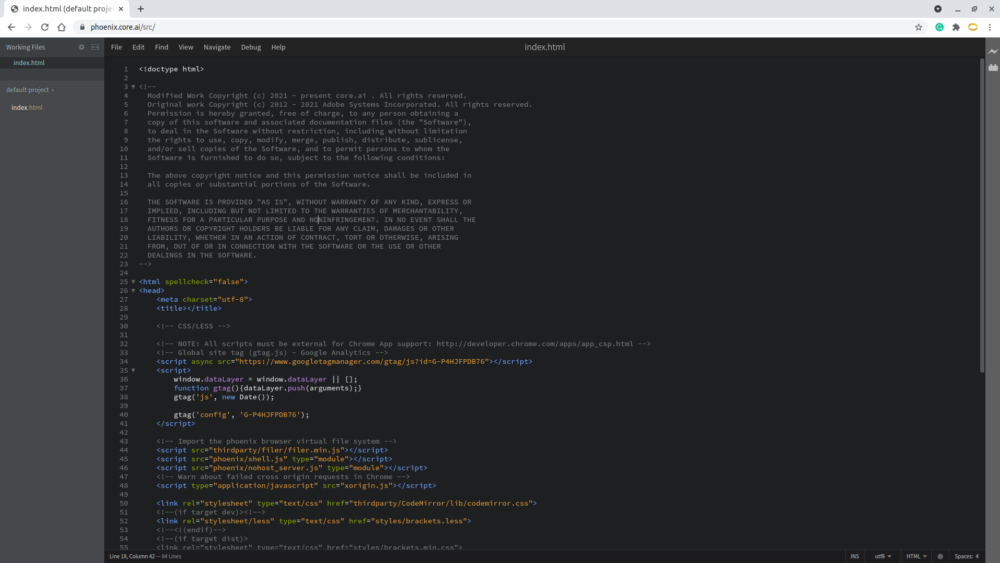

# Welcome to Phoenix!

Phoenix is a modern open-source and free code editor for the web, built for the browser.

Phoenix is in early alpha.  
* **Test out development build of phoenix by visiting this URL:** [**http://phoenix.core.ai/src**](http://phoenix.core.ai/src) 
* Please subscribe to our [notification list](https://core.ai/) to get notified when Phoenix goes live. 

## Tenets
1. Targeted for web development. Js, html and CSS enjoy special status.
2. Light-weight editor.
3. Extension support maintaining full compatibility with Brackets extensions (except brackets-node extensions).
4. Uncompromised local development experience.
5. Support for pluggable remote back-ends.
6. Phoenix core will work from a static web server.

## Status
Phoenix is in alpha and is under active development.
* [Phoenix Alpha development status](https://github.com/aicore/phoenix/issues/11).

## Contributing/ Feedback
* [Get in touch with our community](https://github.com/aicore/phoenix/discussions).
* [Request a new feature](https://github.com/aicore/phoenix/discussions/categories/ideas)
* [Join our Discord community](https://discord.gg/TwgBFCjVBd)
* [Raise issues](https://github.com/aicore/phoenix/issues)
* [Contribute](https://github.com/aicore/phoenix)

## Building Phoenix
[Source Repository](https://github.com/aicore/phoenix) 

* run `npm install`
* To build after npm install: `npm run build`
* clean: `npm run clean`

## Running phoenix
* run `npm run serve` in the terminal.
  * NB: To test Phoenix from an external mobile or machine, use `npm run serveExternal` instead of `serve`   
* Use chrome/edge browser to navigate to [http://localhost:8000/src/index.html](http://localhost:8000/src/index.html)

## Building Release artifacts

* run `npm install`
* To build the release artifacts: `npm run release`
* The release artifacts to host will be in `dist` folder.

## Running tests
* run `npm run test` in the terminal.
  * NB: this will setup all the required files for test 
* Use chrome/edge browser to navigate to Phoenix[http://localhost:8000/src/index.html](http://localhost:8000/src/index.html)
* In Phoenix Menu, select `Debug > run Tests` To open the test runner.
* Run tests as required. 
  * NB: To reset test data files, click on `reset and reload tests` option in the test runner.  

## Acknowledgements
* Phoenix is based on the Brackets code editor by Adobe. Find out more on [Adobe Brackets here](https://github.com/adobe/brackets/).
* Inspired by previous work from the [Mozilla Thimble](https://github.com/mozilla/thimble.mozilla.org) project to port brackets to the web. https://github.com/mozilla/brackets
* In browser server based on [nohost](https://github.com/humphd/nohost) by https://github.com/humphd/

## License
Discussion: https://github.com/aicore/phoenix/issues/184

GNU AGPL-3.0 License

Modified work Copyright (c) 2021 - present Core.ai

Original work Copyright (c) 2012 Adobe Systems Incorporated. All rights reserved.

This program is free software: you can redistribute it and/or modify
it under the terms of the GNU Affero General Public License as
published by the Free Software Foundation, either version 3 of the
License, or (at your option) any later version.

This program is distributed in the hope that it will be useful,
but WITHOUT ANY WARRANTY; without even the implied warranty of
MERCHANTABILITY or FITNESS FOR A PARTICULAR PURPOSE.  See the
GNU Affero General Public License for more details.

You should have received a copy of the GNU Affero General Public License
along with this program.  If not, see https://opensource.org/licenses/AGPL-3.0.

